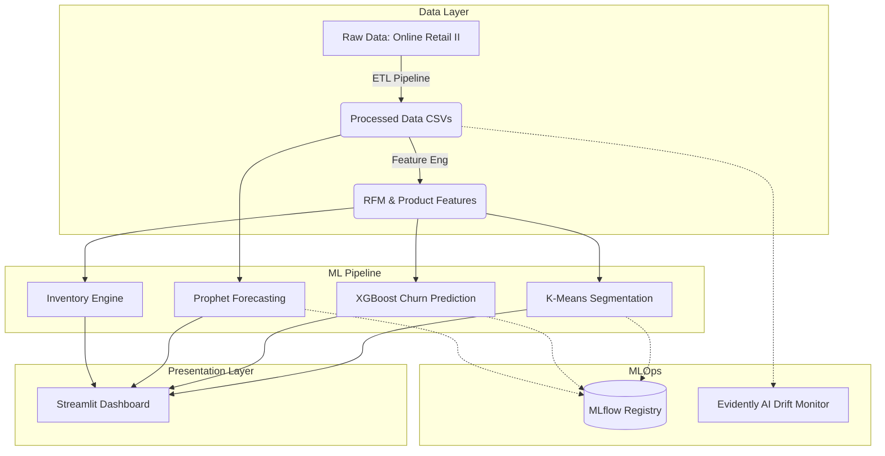

# RetailPulse Enterprise Deployment Guide 🛒📈

RetailPulse is an end-to-end, AI-powered Retail Analytics Platform designed to automate insights for Demand Forecasting, Customer Segmentation, Churn Prediction, and Inventory Optimization.

## 🏗 System Architecture



## 🚀 Quick Start: Docker Deployment

The fastest way to deploy the entire RetailPulse platform (including the Streamlit Dashboard and the MLflow Tracking Server) is via Docker Compose.

### Prerequisites
- Docker Engine & Docker Compose installed.
- Git.

### Deployment Steps
1. **Clone the repository:**
   ```bash
   git clone https://github.com/your-org/retailpulse.git
   cd retailpulse
   ```
2. **Start the containers:**
   ```bash
   docker-compose up --build -d
   ```
3. **Access the Services:**
   - **Streamlit Dashboard:** `http://localhost:8501`
   - **MLflow Tracking UI:** `http://localhost:5000`

## 🛠 Local Python Setup & Execution

If you prefer to run the system directly on your host machine:

### 1. Environment Setup
```bash
python -m venv venv
source venv/bin/activate  # On Windows: venv\Scripts\activate
pip install -r requirements.txt
```

### 2. Full Integration Execution
You can run the entire pipeline end-to-end sequentially:
```powershell
.\run_pipeline.ps1
```
*(This automatically fetches data, cleans it, engineers features, trains all models, tracks them in MLflow, and generates Drift reports).*

### 3. Start Dashboard
```bash
streamlit run dashboard/app.py
```

## 🧪 CI/CD & Testing

- **GitHub Actions:** CI is configured via `.github/workflows/ci.yml`. On every push to `main`, the pipeline automatically executes `flake8` linting and the `pytest` suite.
- **Unit & Integration Tests:** Run `pytest tests/` locally to validate mathematical inventory logic and run the end-to-end ML integration test.

## ⚙️ Configuration Management
All hyperparameters, paths, and ETL rules are managed centrally in `config.yaml`.
- Modify `features.churn_threshold_days` to adjust churn definitions.
- Modify `models.xgboost.learning_rate` to tune the ML models.
- Modify `inventory.lead_time_days` to adjust safety stock recommendations.
